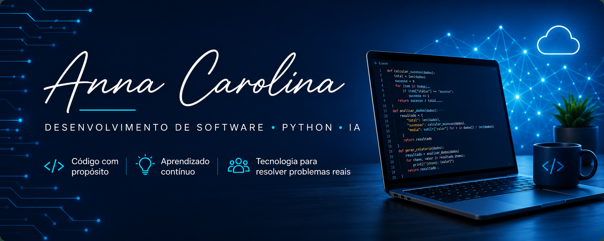

  

## Sobre mim

Sou graduanda em Análise e Desenvolvimento de Sistemas, construindo minha trajetória em tecnologia com foco em desenvolvimento de software, Python e Inteligência Artificial.

Minha experiência profissional anterior em gestão de projetos contribuiu para desenvolver organização, visão de processos, análise de problemas e trabalho em equipe — competências que hoje também aplico no desenvolvimento e na análise de soluções tecnológicas.

Além da graduação, desenvolvo projetos próprios, acadêmicos e estudos práticos, buscando transformar conceitos de programação em soluções para problemas reais e evoluir continuamente minhas competências técnicas.

🎯 **Objetivo atual:** oportunidades de estágio ou posições júnior em Desenvolvimento de Software e IA.

## Tech Stack

**Linguagens**

**Desenvolvimento Web**

**Ferramentas**

**Ambiente de desenvolvimento & IA**

## 🚀 Projetos em destaque

### Reativa 

**SaaS B2B em desenvolvimento para apoiar pequenos negócios na reativação de clientes recorrentes.**

A solução utiliza dados de atendimentos anteriores e regras de negócio para identificar clientes próximos do período esperado de retorno, facilitando ações de relacionamento e reativação.

**Conceitos aplicados:**

`APIs REST` `Autenticação` `Modelagem de Dados` `Multi-tenant` `Arquitetura` `Git`

No projeto, venho trabalhando desde a definição das regras de negócio e arquitetura até o desenvolvimento de backend e frontend.

**Status:** Em desenvolvimento 🚧

[Ver repositório →](https://github.com/annacm0/reativa.git)

### teAchei

**Análise técnica de uma aplicação web real de achados e perdidos baseada em etiquetas QR Code.**

Fui convidada a apoiar tecnicamente o projeto e iniciei minha participação realizando um diagnóstico do código e da arquitetura existentes, antes de qualquer alteração na aplicação.

Durante a análise, avaliei arquitetura e organização do projeto, integração entre frontend e backend, API e banco de dados, estrutura de rotas, controllers, services e models, além de dependências, código legado, configurações de ambiente, riscos de segurança e dívida técnica.

**Stack analisada**

`Node.js` `Express` `EJS` `AngularJS` `MongoDB` `Mongoose` `Railway`

O diagnóstico resultou em uma documentação técnica com os problemas identificados, seus impactos e a priorização das melhorias.

🔒 **Repositório privado por decisão da empresa.**

## 📚 Projetos de aprendizagem

Projetos desenvolvidos durante minha graduação e estudos complementares para consolidar fundamentos de programação e desenvolvimento de software.

### Python Fundamentos

Exercícios práticos de lógica de programação e fundamentos da linguagem, incluindo entrada e saída de dados, operadores e estruturas condicionais.

`Python`

[Ver repositório →](https://github.com/annacm0/python-fundamentos)

### Jornada Viagens

Interface web para uma agência de turismo fictícia, desenvolvida para praticar estruturação de páginas, estilização e responsividade.

`HTML` `CSS`

[Ver repositório →](https://github.com/annacm0/jornada-viagens)

### Tecboard

Projeto acadêmico simulando etapas da criação de uma aplicação de monitoramento de sistemas, envolvendo planejamento, levantamento de requisitos, prototipação e desenvolvimento.

`HTML` `CSS`

[Ver repositório →](https://github.com/annacm0/tecboard.git)

### Pesquisa Culturama

Formulário web desenvolvido para praticar estruturação de interfaces, formulários e estilização.

`HTML` `CSS`

[Ver repositório →](https://github.com/annacm0/pesquisa-culturama.git)

<b>Outros projetos & exercícios</b>

**Netflix Clone**  
Projeto de prática em desenvolvimento web.  
[Ver repositório →](https://github.com/annacm0/netflix-interface-practice.git)

 

**Cálculo de IMC em C**  
Exercício para prática de lógica de programação e estruturas condicionais.  
[Ver repositório →](https://github.com/annacm0/calculo-imc-c.git)

 

**Despesas de viagem em C**  
Exercício desenvolvido para praticar fundamentos da linguagem C.  
[Ver repositório →](https://github.com/annacm0/despesas_viagem.git)

 

Projetos desenvolvidos ao longo dos meus estudos para praticar lógica de programação e fundamentos de desenvolvimento.

## 🌱 Atualmente estudando

Aprofundando meus conhecimentos por meio da graduação, cursos e desenvolvimento de projetos práticos.

`Python` • `APIs` • `Inteligência Artificial` • `Cloud` • `Arquitetura de Software` • `Banco de Dados e Modelagem de Dados` 

## Contato

Aberta a oportunidades de estágio e posições júnior em tecnologia, além de conexões e trocas com profissionais e estudantes da área.

  Desenvolvendo conhecimento através de projetos, prática e aprendizado contínuo.

